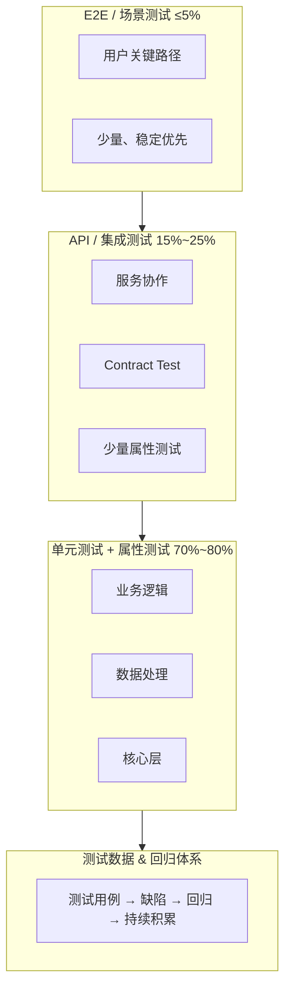

# Linux基础与测试专题

主讲人：曾宏
时间：2026-04-16

---

## 一、Linux 基础：设计哲学与思维模型

### 1.1 Unix 哲学：一切设计的根基

#### 1.1.1 核心原则

**1. 一个程序只做一件事，并做好它（Do One Thing Well）**

```bash
# 不是一个"超级工具"做所有事
# 而是多个小工具组合

cat file.txt | grep "error" | wc -l
#   读文件      过滤         计数
```

**为什么这样设计？**
- 每个工具简单 → 容易测试、容易维护
- 组合灵活 → 应对未知需求
- 失败隔离 → 一个坏了不影响其他

**对你写代码的启示：**
- 函数应该小而专注
- 微服务优于单体（在合适的场景）
- 模块化思维

**2. 文本是通用接口（Text as Universal Interface）**

```bash
# 所有工具的输入输出都是文本
ps aux | grep nginx | awk '{print $2}' | xargs kill
```

**为什么是文本？**
- 人类可读 → 调试方便
- 工具无关 → 任何语言都能处理
- 版本控制友好 → diff 能看出变化

**对你写代码的启示：**
- API 返回 JSON（文本）而非二进制
- 日志要人类可读
- 配置文件用 YAML/JSON 而非私有格式

**3. 组合优于继承（Composition over Inheritance）**

```bash
# 不需要修改 grep 的源码来添加功能
# 只需要和其他工具组合
grep "error" log.txt | sort | uniq -c | sort -rn
```

**对你写代码的启示：**
- 优先用组合而非继承
- 设计可插拔的组件
- 依赖注入

#### 1.1.2 管道思维（Pipeline Thinking）

```
输入 → 处理1 → 处理2 → 处理3 → 输出
```

这不只是 Linux 命令，这是一种**数据流思维**：

| 领域 | 体现 |
|------|------|
| Linux | `cat \| grep \| sort \| uniq` |
| 函数式编程 | `list.filter().map().reduce()` |
| 数据处理 | ETL（Extract → Transform → Load） |
| CI/CD | Build → Test → Deploy |
| 机器学习 | 数据 → 预处理 → 训练 → 评估 |

**核心思想：**
- 每个阶段只关心自己的输入和输出
- 阶段之间通过标准接口连接
- 可以随时插入、替换、删除某个阶段

---

### 1.2 一切皆文件：统一抽象的力量

#### 1.2.1 为什么"一切皆文件"是天才设计？

```bash
# 读取 CPU 信息
cat /proc/cpuinfo

# 读取内存信息
cat /proc/meminfo

# 读取网络连接
cat /proc/net/tcp

# 向设备写入
echo "Hello" > /dev/ttyUSB0
```

**硬件、进程、网络、配置……全都是"文件"。**

**这意味着什么？**
- 只需要学会一套 API（open/read/write/close）
- 任何工具都能操作任何资源
- 权限模型统一（rwx 适用于一切）

**对你写代码的启示：**
- 统一抽象的价值：一个接口解决一类问题
- 例如：数据库连接池、HTTP 客户端、消息队列 → 都可以抽象为"资源"

#### 1.2.2 文件描述符：资源的统一句柄

```
0 = stdin  （标准输入）
1 = stdout （标准输出）
2 = stderr （标准错误）
```

```bash
# 重定向本质是"换一个文件描述符指向的目标"
command > output.txt    # 1 指向 output.txt
command 2>&1            # 2 指向 1 指向的地方
```

**对你写代码的启示：**
- 资源句柄模式（Handle Pattern）
- 连接池本质是"句柄复用"
- 关闭资源 = 释放句柄

---

### 1.3 权限模型：最小权限原则

#### 1.3.1 为什么要有权限？

```
-rw-r--r-- 1 user group 1234 Apr 15 10:00 config.txt
```

**不是为了"限制你"，而是为了"保护系统"。**

**最小权限原则（Principle of Least Privilege）：**
> 每个程序、每个用户，只应该拥有完成任务所需的最小权限。

**为什么重要？**
- 攻击者拿到普通用户权限 → 无法破坏系统
- 程序 bug 导致误操作 → 影响范围有限
- 审计追踪 → 谁做了什么

#### 1.3.2 sudo 的设计智慧

```bash
sudo apt install nginx
```

**为什么不直接用 root 登录？**

| 方式 | 风险 |
|------|------|
| 一直用 root | 任何误操作都是致命的 |
| 用 sudo | 只在需要时提权，有审计日志 |

**对你写代码的启示：**
- 数据库连接不要用 root
- API 要有权限控制
- 敏感操作要有审计日志

---

### 1.4 进程模型：隔离与通信

#### 1.4.1 进程 vs 线程：隔离的代价

| | 进程 | 线程 |
|---|------|------|
| 内存 | 独立 | 共享 |
| 创建成本 | 高 | 低 |
| 崩溃影响 | 只影响自己 | 可能影响整个进程 |
| 通信 | 需要 IPC | 直接共享内存 |

**Linux 的选择：进程优先**

```bash
# 每个命令都是独立进程
ps aux | grep nginx | wc -l
# 三个进程，互不影响
```

**对你写代码的启示：**
- 微服务 = 进程级隔离
- 容器 = 进程 + 资源限制
- 选择隔离级别要权衡：隔离性 vs 性能

#### 1.4.2 信号：进程间的"中断"

```bash
kill -15 PID   # SIGTERM：请优雅退出
kill -9 PID    # SIGKILL：立即死亡
```

**为什么有两种？**
- SIGTERM：给进程机会清理资源（关闭连接、保存状态）
- SIGKILL：进程不响应时的最后手段

**对你写代码的启示：**
- 程序要处理 SIGTERM，优雅关闭
- Kubernetes 先发 SIGTERM，等待后发 SIGKILL
- 这就是"优雅停机"

```go
// Go 中处理信号
quit := make(chan os.Signal, 1)
signal.Notify(quit, syscall.SIGTERM, syscall.SIGINT)
<-quit
// 清理资源...
```

---

### 1.5 网络模型：分层的艺术

#### 1.5.1 为什么要分层？

```
应用层    HTTP, DNS, SSH
传输层    TCP, UDP
网络层    IP
链路层    Ethernet, WiFi
```

**每层只关心自己的事：**
- HTTP 不关心数据怎么传输
- TCP 不关心数据是什么
- IP 不关心物理介质

**对你写代码的启示：**
- 分层架构（Controller → Service → Repository）
- 每层有清晰的职责边界
- 层与层之间通过接口通信

#### 1.5.2 端口：服务的"门牌号"

```
IP 地址 = 哪台机器
端口    = 机器上的哪个服务
```

```bash
# 一台机器可以运行多个服务
:80   → Nginx
:8080 → 你的应用
:3306 → MySQL
:6379 → Redis
```

**对你写代码的启示：**
- 服务发现的本质：找到 IP + 端口
- 负载均衡的本质：多个 IP:端口 选一个

---

### 1.6 Shell 脚本：自动化思维

#### 1.6.1 脚本的本质

**脚本 = 把你手动敲的命令记录下来，让机器重复执行。**

```bash
# 你手动做的事：
ssh server1 "systemctl restart app"
ssh server2 "systemctl restart app"
ssh server3 "systemctl restart app"

# 脚本化：
for server in server1 server2 server3; do
    ssh $server "systemctl restart app"
done
```

**自动化的价值：**
- 可重复 → 不会遗漏步骤
- 可版本控制 → 知道谁改了什么
- 可审计 → 出问题能追溯

#### 1.6.2 幂等性：脚本设计的核心原则

> 执行一次和执行多次，结果相同。

```bash
# 不幂等（危险）
echo "export PATH=/usr/local/bin:$PATH" >> ~/.bashrc
# 执行多次会重复添加

# 幂等（安全）
grep -q "export PATH=/usr/local/bin" ~/.bashrc || \
    echo "export PATH=/usr/local/bin:$PATH" >> ~/.bashrc
# 先检查，不存在才添加
```

**对你写代码的启示：**
- API 设计要考虑幂等性
- 数据库迁移脚本要幂等
- CI/CD 流程要幂等

#### 1.6.3 失败处理：脚本的健壮性

```bash
#!/bin/bash
set -e          # 任何命令失败立即退出
set -u          # 使用未定义变量报错
set -o pipefail # 管道中任何命令失败都算失败

# 这三行应该成为你所有脚本的开头
```

**对你写代码的启示：**
- Fail Fast：尽早发现错误
- 不要忽略错误返回值
- 错误处理要显式

---

### 1.7 思维模型总结

| 原则 | Linux 体现 | 代码设计启示 |
|------|-----------|-------------|
| 单一职责 | 每个命令只做一件事 | 函数/类职责单一 |
| 组合优于继承 | 管道组合小工具 | 用组合而非继承 |
| 统一抽象 | 一切皆文件 | 统一接口设计 |
| 最小权限 | 用户/权限模型 | API 权限控制 |
| 分层 | 网络协议栈 | 分层架构 |
| 幂等性 | 脚本设计 | API/迁移脚本设计 |
| 优雅降级 | SIGTERM vs SIGKILL | 优雅停机 |
| 文本接口 | 标准输入输出 | JSON API |

---

### 1.8 资源管理与可观测性

#### 1.8.1 Linux 的四大核心资源

```
┌─────────────────────────────────────────────────┐
│                    应用程序                      │
├─────────────────────────────────────────────────┤
│  CPU        内存        磁盘 I/O      网络 I/O   │
│  (计算)     (存储)      (持久化)      (通信)     │
└─────────────────────────────────────────────────┘
```

**所有性能问题，最终都归结为这四类资源的瓶颈。**

| 资源 | 瓶颈表现 | 典型原因 |
|------|---------|---------|
| CPU | 响应慢、负载高 | 计算密集、死循环、锁竞争 |
| 内存 | OOM、频繁 GC | 内存泄漏、缓存过大 |
| 磁盘 I/O | 读写慢、iowait 高 | 日志过多、数据库慢查询 |
| 网络 I/O | 延迟高、超时 | 带宽不足、连接数过多 |

#### 1.8.2 资源观测命令

**CPU：**

```bash
# 整体负载
uptime
# 10:00:00 up 30 days, load average: 1.50, 1.20, 0.80
#                                    1分钟 5分钟 15分钟
# 负载 = 等待 CPU 的进程数，理想值 ≤ CPU 核心数

# CPU 使用率
top
# %Cpu(s): 20.0 us,  5.0 sy,  0.0 ni, 70.0 id,  5.0 wa
#          用户态   内核态   nice    空闲     I/O等待

# 每个 CPU 核心
mpstat -P ALL 1

# 进程级 CPU
pidstat 1
```

**内存：**

```bash
# 内存概览
free -h
#               total    used    free    shared  buff/cache   available
# Mem:           16Gi    8.0Gi   2.0Gi   500Mi      6.0Gi        7.5Gi
#                                                              ↑ 实际可用

# 进程内存
ps aux --sort=-%mem | head -10

# 详细内存映射
cat /proc/meminfo
```

**磁盘 I/O：**

```bash
# 磁盘空间
df -h

# I/O 使用率
iostat -x 1
# %util = 磁盘繁忙程度，接近 100% 说明是瓶颈

# 哪个进程在读写
iotop
```

**网络 I/O：**

```bash
# 网络流量
sar -n DEV 1
# 或
nload

# 连接状态
ss -s
netstat -ant | awk '{print $6}' | sort | uniq -c

# 每个进程的网络
nethogs
```

#### 1.8.3 关键指标（Prometheus 会采集这些）

| 类别 | 指标 | 含义 | 告警阈值参考 |
|------|------|------|-------------|
| **CPU** | `node_load1` | 1分钟负载 | > CPU核心数 × 0.7 |
| | `node_cpu_seconds_total` | CPU 使用时间 | idle < 20% |
| **内存** | `node_memory_MemAvailable_bytes` | 可用内存 | < 10% |
| | `node_memory_SwapUsed_bytes` | Swap 使用 | > 0（不应该用 Swap） |
| **磁盘** | `node_filesystem_avail_bytes` | 磁盘剩余 | < 20% |
| | `node_disk_io_time_seconds_total` | I/O 时间 | %util > 80% |
| **网络** | `node_network_receive_bytes_total` | 接收流量 | 接近带宽上限 |
| | `node_network_transmit_bytes_total` | 发送流量 | 接近带宽上限 |

#### 1.8.4 /proc 和 /sys：指标的来源

**所有监控工具的数据都来自这两个虚拟文件系统：**

```bash
# CPU 信息
cat /proc/stat
cat /proc/cpuinfo

# 内存信息
cat /proc/meminfo

# 进程信息
cat /proc/[pid]/status
cat /proc/[pid]/io

# 网络信息
cat /proc/net/dev
cat /proc/net/tcp

# 磁盘信息
cat /proc/diskstats
```

**Prometheus 的 node_exporter 就是读取这些文件，转换成指标格式。**

```
# /proc/meminfo 内容
MemTotal:       16384000 kB
MemFree:         2048000 kB
MemAvailable:    8000000 kB
...

# 转换为 Prometheus 指标
node_memory_MemTotal_bytes 16777216000
node_memory_MemFree_bytes 2097152000
node_memory_MemAvailable_bytes 8192000000
```

#### 1.8.5 USE 方法论：系统性排查思路

**Brendan Gregg 提出的 USE 方法：**

> 对每种资源，检查 **U**tilization（使用率）、**S**aturation（饱和度）、**E**rrors（错误）。

| 资源 | Utilization | Saturation | Errors |
|------|-------------|------------|--------|
| CPU | CPU 使用率 | 运行队列长度（load） | - |
| 内存 | 内存使用率 | Swap 使用、OOM | 分配失败 |
| 磁盘 | %util | I/O 等待队列 | 读写错误 |
| 网络 | 带宽使用率 | 丢包、重传 | 网络错误 |

**排查流程：**

```
1. 用户反馈"慢"
    ↓
2. 检查四大资源的 USE
    ↓
3. 找到瓶颈资源
    ↓
4. 深入分析该资源
    ↓
5. 定位具体进程/代码
```

#### 1.8.6 从命令行到监控系统

| 命令行 | 问题 | 监控系统解决 |
|--------|------|-------------|
| `top` | 只能看当前 | 历史数据、趋势分析 |
| `free -h` | 需要登录服务器 | 远程查看、集中管理 |
| 手动执行 | 不能 7×24 | 自动采集、告警 |
| 文本输出 | 不直观 | 图表可视化 |

**这就是为什么需要 Prometheus + Grafana：**

```
┌─────────────┐     ┌─────────────┐     ┌─────────────┐
│   服务器     │     │ Prometheus  │     │  Grafana    │
│             │     │             │     │             │
│ node_exporter ──→ │  采集存储   │ ──→ │  可视化     │
│ (读 /proc)  │     │  告警规则   │     │  Dashboard  │
└─────────────┘     └─────────────┘     └─────────────┘
```

#### 1.8.7 思维模型：可观测性三支柱

| 支柱 | 作用 | 工具 |
|------|------|------|
| **Metrics（指标）** | 知道"有问题" | Prometheus |
| **Logs（日志）** | 知道"什么问题" | ELK / Loki |
| **Traces（链路）** | 知道"哪里问题" | Jaeger / Zipkin |

**监控的本质：**
> 把 /proc 里的数字，变成人能理解的图表和告警。

### 1.9 命令速查（AI 时代的用法）

> 以下命令不需要背，需要时问 AI 或查文档。
> 重要的是知道"有这个能力"，而不是"记住语法"。

| 能力 | 关键词（问 AI 用） |
|------|-------------------|
| 查看文件内容 | cat, less, tail -f |
| 搜索文本 | grep, 正则表达式 |
| 查看进程 | ps, top, htop |
| 查看端口 | netstat, lsof, ss |
| 后台运行 | nohup, screen, tmux |
| HTTP 请求 | curl POST JSON |
| 远程连接 | ssh, scp |
| 权限修改 | chmod, chown |
| 包管理 | apt install, yum |
| 磁盘/内存 | df -h, free -h |

---

## 二、软件测试架构

### 2.1 测试金字塔模型



**核心原则：越往下越多，越往上越少**

---

### 2.2 分层职责详解

#### 2.2.1 单元测试 + 属性测试（核心层）

**占比：70%~80%**

**测试目标：**
- 纯业务逻辑
- 算法
- 数据结构
- 工具函数

**两种测试方式的本质区别：**

| 类型 | 本质 | 特点 |
|------|------|------|
| 单元测试 | 点验证 | 验证特定输入的特定输出 |
| 属性测试 | 面覆盖 | 验证输入空间的通用性质 |

**记忆技巧：点 vs 面**

**单元测试 = 打靶（点）**

你想好几个具体的例子，一个一个验证：

```go
// 我想到了这几个点
ValidateEmail("test@example.com") == true   // 正常邮箱
ValidateEmail("invalid")          == false  // 没有 @
ValidateEmail("")                 == false  // 空字符串
```

**属性测试 = 撒网（面）**

你不想具体的例子，而是描述"不管输入什么，这个性质必须成立"：

```go
// 不管密码是什么，哈希后一定不等于原密码
∀ password: Hash(password) != password

// 不管密码是什么，哈希后再验证一定通过
∀ password: Verify(Hash(password), password) == true
```

**对比记忆：**

| | 单元测试 | 属性测试 |
|---|---------|---------|
| 思维方式 | 我想几个例子 | 我描述一个规律 |
| 输入 | 手写的具体值 | 自动生成的随机值 |
| 验证 | 这个输入 → 这个输出 | 任意输入 → 某个性质成立 |
| 比喻 | 打靶（点） | 撒网（面） |
| 擅长发现 | 已知的边界情况 | 未知的边界情况 |

**什么时候用哪个？**

- **单元测试**：业务逻辑、已知的边界条件、回归 bug
- **属性测试**：数学性质、编解码、数据转换、"不管怎样都应该成立"的规则

> 💡 **一句话记忆**：单元测试问"这个例子对不对"，属性测试问"这个规律对不对"。

**属性测试验证的内容：**
- 不变量（Invariant）
- 数学性质
- 输入空间完整性

**属性测试示例：**

```go
// 排序算法的属性
func TestSort_Properties(t *testing.T) {
    rapid.Check(t, func(t *rapid.T) {
        input := rapid.SliceOf(rapid.Int()).Draw(t, "input")
        result := Sort(input)
        
        // 属性1：输出有序
        assert.True(t, isSorted(result))
        
        // 属性2：元素不丢失
        assert.ElementsMatch(t, input, result)
        
        // 属性3：长度不变
        assert.Equal(t, len(input), len(result))
    })
}

// 缓存的属性
func TestCache_Properties(t *testing.T) {
    rapid.Check(t, func(t *rapid.T) {
        key := rapid.String().Draw(t, "key")
        value := rapid.String().Draw(t, "value")
        
        cache := NewCache()
        cache.Set(key, value)
        
        // 属性：get(set(x)) == x
        got, _ := cache.Get(key)
        assert.Equal(t, value, got)
    })
}

// 金额计算的属性
func TestAmount_Properties(t *testing.T) {
    rapid.Check(t, func(t *rapid.T) {
        items := rapid.SliceOf(rapid.Float64Range(0, 10000)).Draw(t, "items")
        
        total := CalculateTotal(items)
        
        // 属性1：总金额 ≥ 0
        assert.GreaterOrEqual(t, total, 0.0)
        
        // 属性2：不溢出
        assert.False(t, math.IsInf(total, 0))
    })
}
```

---

#### 2.2.2 集成测试（连接正确性）

**占比：15%~25%**

**测试目标：**
- 模块之间交互
- 数据库 / 缓存
- 外部依赖

**关键机制：**

| 机制 | 作用 |
|------|------|
| Contract Test | 验证 API schema 不变 |
| Service Virtualization | Mock 外部系统 |

**集成层的属性测试（少量）：**

验证"系统性质"而非"功能点"：

```go
// 幂等性：多次调用结果一致
func TestAPI_Idempotent(t *testing.T) {
    rapid.Check(t, func(t *rapid.T) {
        req := generateRequest(t)
        
        result1 := api.Call(req)
        result2 := api.Call(req)
        
        assert.Equal(t, result1, result2)
    })
}

// 顺序无关性
func TestBatchProcess_OrderIndependent(t *testing.T) {
    rapid.Check(t, func(t *rapid.T) {
        items := rapid.SliceOf(rapid.Int()).Draw(t, "items")
        
        result1 := Process(items)
        result2 := Process(shuffle(items))
        
        assert.ElementsMatch(t, result1, result2)
    })
}
```

---

#### 2.2.3 E2E 测试（业务验证）

**占比：≤5%**

**测试目标：**
- 用户关键流程
- 下单流程
- 登录流程
- 支付流程

**原则：**
- ✅ 只测关键路径
- ✅ 稳定优先
- ❌ 不追求覆盖率

---

### 2.3 测试数据体系

#### 2.3.1 测试数据分层

| 类型 | 用途 | 特点 |
|------|------|------|
| 🟢 固定用例（Golden Cases） | 稳定用于 CI | 确定性、可重复 |
| 🟡 随机数据（Property-based） | 自动生成覆盖边界 | 发现边界问题 |
| 🔴 缺陷数据（Regression Set） | 历史 bug | 永不回归 |

#### 2.3.2 什么是回归测试？

**回归测试（Regression Testing）的核心含义：**

> **确保修改代码后，原来能用的功能还能用。**

**为什么叫"回归"？**

"回归"指的是 bug 回来了。你修了一个 bug，结果改动引入了新 bug，或者把之前修好的 bug 又弄坏了——这就是"回归"。

回归测试就是防止这种事发生。

**具体做法：**

1. 发现一个 bug
2. 修复它
3. **写一个测试用例专门覆盖这个 bug**
4. 把这个用例加入测试集
5. 以后每次改代码，都跑这个测试
6. 如果测试挂了 → bug 回归了 → 不允许合并

**举个例子：**

```go
// BUG-001: 用户密码 "123456" 能通过验证（应该拒绝，太短）
// 修复后，写测试：

func TestBug001_ShortPasswordShouldFail(t *testing.T) {
    valid, _ := ValidatePassword("123456")
    if valid {
        t.Error("BUG-001 regression: short password should be rejected")
    }
}
```

这个测试永远留在代码库里。以后谁改了密码验证逻辑，如果不小心让短密码通过了，CI 立刻报错。

> 💡 **一句话记忆**：回归测试 = 把历史 bug 变成测试用例，确保同样的错误不会再犯第二次。

#### 2.3.3 数据闭环（质量持续提升的核心）

```
线上 bug
    ↓
转为测试用例
    ↓
加入回归测试
    ↓
CI 自动验证
    ↓
质量持续提升
```

**这是质量持续提升的核心机制**

---

### 2.4 CI/CD Pipeline

#### 2.4.1 每次提交（必须快）

```bash
# 阶段1：单元测试 + 属性测试 (<1 min)
go test ./... -short

# 阶段2：集成测试（mock）(<3 min)
go test ./... -tags=integration

# ✅ 通过 → 才能 merge
```

#### 2.4.2 定时任务（Nightly）

- 全量集成测试
- 大规模数据测试
- 回归测试

#### 2.4.3 发布前

- E2E 测试
- 性能测试
- 安全测试

---

### 2.5 环境体系

| 环境 | 特点 | 测试类型 |
|------|------|----------|
| Dev | 本地开发，mock 依赖 | 单元测试、属性测试 |
| Test / Staging | 接近生产，完整依赖 | 集成测试、E2E |
| Production | 真实环境 | 监控、告警 |

**原则：越靠近生产 → 测试越少，但越真实**

---

### 2.6 关键工程实践

#### 2.6.1 测试金字塔（必须遵守）

```
        /\
       /  \      E2E（最少）
      /----\
     /      \    集成测试（适中）
    /--------\
   /          \  单元测试（最多）
  /------------\
```

#### 2.6.2 快速反馈

**CI 必须在几分钟内完成**

否则：团队会绕过测试 → 质量崩塌

#### 2.6.3 自动化优先

所有回归测试必须自动化

#### 2.6.4 小步提交

减少测试复杂度，降低定位问题的成本

#### 2.6.5 Mock 与隔离

避免测试依赖不稳定系统

---

### 2.7 测试能力模型

将整个体系抽象成四层能力：

| 层次 | 能力 | 实现方式 | 保证 |
|------|------|----------|------|
| 1️⃣ | 正确性（Correctness） | 单元测试 + 属性测试 | 代码"逻辑正确" |
| 2️⃣ | 连接性（Integration） | 集成测试 + Contract Test | 系统"能协作" |
| 3️⃣ | 可用性（Usability） | E2E 测试 | "用户能用" |
| 4️⃣ | 持续质量（Quality Evolution） | 回归测试 + 数据闭环 | "不退化" |

---

### 2.8 示例项目：user-auth-demo

配套示例项目位于 `user-auth-demo/`，技术栈：Go + Gin + GORM + SQLite + Wire

#### 2.8.1 项目结构

```
user-auth-demo/
├── cmd/server/                 # 入口
│   └── main.go
├── internal/
│   ├── config/                 # 配置
│   ├── domain/                 # 领域模型
│   │   └── user.go
│   ├── handler/                # HTTP 处理器
│   │   └── auth_handler.go
│   ├── middleware/             # 中间件
│   │   └── auth_middleware.go
│   ├── pkg/                    # 内部工具包
│   │   ├── hash/               # 密码哈希
│   │   │   ├── hash.go
│   │   │   └── hash_test.go    # 单元 + 属性测试
│   │   ├── token/              # JWT Token
│   │   │   ├── token.go
│   │   │   └── token_test.go   # 单元 + 属性测试
│   │   └── validator/          # 验证器
│   │       ├── validator.go
│   │       └── validator_test.go # 单元 + 属性测试
│   ├── repository/             # 数据仓储
│   │   ├── user_repository.go
│   │   ├── user_repository_test.go  # 集成测试
│   │   └── mock_user_repository.go  # Mock 实现
│   ├── service/                # 业务服务
│   │   ├── auth_service.go
│   │   ├── auth_service_test.go      # 集成测试
│   │   └── auth_service_mock_test.go # Mock 隔离测试
│   └── wire/                   # 依赖注入
├── test/
│   ├── benchmark/              # 压力测试
│   │   ├── login.lua           # wrk 登录压测脚本
│   │   ├── register.lua        # wrk 注册压测脚本
│   │   └── README.md
│   ├── contract/               # Contract 测试
│   │   └── api_contract_test.go
│   ├── e2e/                    # E2E 测试
│   │   └── auth_e2e_test.go
│   ├── fixtures/               # 固定测试数据
│   │   └── golden_cases.json
│   ├── integration/            # 集成测试（幂等性等）
│   │   └── idempotent_test.go
│   └── regression/             # 回归测试数据
│       └── bug_cases.json
├── Makefile
└── README.md
```

#### 2.8.2 测试文件与文档对应关系

| 文档概念 | 示例文件 | 说明 |
|---------|---------|------|
| 单元测试（点验证） | `validator_test.go` | `TestValidateEmail` 等 |
| 属性测试（面覆盖） | `hash_test.go` | `TestHash_Property_Roundtrip` |
| 集成测试（DB交互） | `user_repository_test.go` | 与 SQLite 交互 |
| Mock 隔离测试 | `auth_service_mock_test.go` | 不依赖真实 DB |
| Contract Test | `api_contract_test.go` | 验证 API 响应结构 |
| 幂等性测试 | `idempotent_test.go` | 系统性质验证 |
| E2E 测试 | `auth_e2e_test.go` | 注册→登录→获取信息 |
| 压力测试 | `benchmark/*.lua` | wrk 压测脚本 |
| 固定测试数据 | `golden_cases.json` | Golden Cases |
| 回归测试数据 | `bug_cases.json` | 历史 bug 用例 |

#### 2.8.3 Makefile

```makefile
# 快速测试（CI 每次提交）
make test

# 单元测试
make test-unit

# 集成测试
make test-integration

# Contract 测试（API 契约）
make test-contract

# E2E 测试
make test-e2e

# 全量测试（Nightly）
make test-all

# 属性测试
make test-property

# 压力测试（需要先启动服务）
make bench-login      # 登录接口压测
make bench-register   # 注册接口压测
make bench-quick      # 快速压测（10秒）
```

#### 2.8.4 核心属性测试示例

**密码哈希的属性（hash_test.go）：**

```go
// 核心属性：Verify(Hash(password), password) == true
func TestHash_Property_Roundtrip(t *testing.T) {
    rapid.Check(t, func(t *rapid.T) {
        password := rapid.StringN(1, 72, 72).Draw(t, "password")

        hashed, _ := HashPassword(password)

        if !VerifyPassword(hashed, password) {
            t.Errorf("Verify(Hash(%q), %q) should be true", password, password)
        }
    })
}

// 属性：Hash(password) != password
func TestHash_Property_NotEqual(t *testing.T) {
    rapid.Check(t, func(t *rapid.T) {
        password := rapid.StringN(1, 72, 72).Draw(t, "password")

        hashed, _ := HashPassword(password)

        if hashed == password {
            t.Errorf("Hash(%q) should not equal %q", password, password)
        }
    })
}
```

**Token 的属性（token_test.go）：**

```go
// 核心属性：Parse(Generate(user)) == user
func TestToken_Property_Roundtrip(t *testing.T) {
    g := NewGenerator("test-secret-key", time.Hour)

    rapid.Check(t, func(t *rapid.T) {
        userID := rapid.Uint().Draw(t, "userID")
        email := rapid.StringMatching(`^[a-z]+@[a-z]+\.[a-z]+$`).Draw(t, "email")

        tokenStr, _ := g.Generate(userID, email)
        claims, _ := g.Parse(tokenStr)

        if claims.UserID != userID || claims.Email != email {
            t.Error("roundtrip failed")
        }
    })
}
```

#### 2.8.5 Contract Test 示例

```go
// 验证注册接口响应结构
func TestContract_Register_Response(t *testing.T) {
    // ... 发送请求 ...

    // 验证响应结构（Contract）
    requiredFields := []string{"token", "user"}
    for _, field := range requiredFields {
        if _, exists := resp[field]; !exists {
            t.Errorf("response missing required field: %s", field)
        }
    }

    // 验证密码不在响应中（安全性）
    if _, exists := user["password"]; exists {
        t.Error("password should NOT be in response")
    }
}
```

#### 2.8.6 幂等性测试示例

```go
// 登录接口幂等性：多次调用返回相同结果
func TestIdempotent_Login(t *testing.T) {
    // 注册用户后...
    
    // 多次登录
    for i := 0; i < 5; i++ {
        resp := login(email, password)
        if resp.Code != http.StatusOK {
            t.Errorf("login attempt %d failed", i+1)
        }
    }
}
```

---

### 2.9 测试工具速查表

#### 2.9.1 按语言分类

| 测试类型 | Go | Java | Python | JavaScript/TypeScript |
|---------|-----|------|--------|----------------------|
| **单元测试框架** | testing (内置) | JUnit 5 | pytest | Jest / Vitest |
| **断言库** | testify | AssertJ | pytest (内置) | Chai / expect |
| **属性测试** | rapid | jqwik / QuickTheories | Hypothesis | fast-check |
| **Mock** | gomock / testify/mock | Mockito | unittest.mock / pytest-mock | Jest mock / Sinon |
| **HTTP 测试** | httptest (内置) | MockMvc / RestAssured | requests-mock / httpx | supertest / msw |
| **集成测试（DB）** | testcontainers-go | Testcontainers | testcontainers-python | testcontainers |
| **Contract Test** | pact-go | Pact JVM | pact-python | Pact JS |
| **E2E（API）** | httptest | RestAssured | requests / httpx | supertest |
| **E2E（浏览器）** | chromedp / rod | Selenium / Playwright | Playwright / Selenium | Playwright / Cypress |
| **覆盖率** | go test -cover | JaCoCo | coverage.py / pytest-cov | c8 / istanbul |
| **性能测试** | testing.B (内置) | JMH | locust / pytest-benchmark | k6 / Artillery |

#### 2.9.2 按测试类型分类

| 测试类型 | 推荐工具 | 说明 |
|---------|---------|------|
| **单元测试** | 语言内置 + 断言库 | Go: testing + testify, Java: JUnit + AssertJ |
| **属性测试** | rapid (Go), Hypothesis (Python), fast-check (JS) | 自动生成随机输入 |
| **Mock/Stub** | gomock, Mockito, Jest mock | 隔离外部依赖 |
| **集成测试（DB）** | Testcontainers | Docker 启动真实数据库 |
| **集成测试（内存DB）** | SQLite :memory: | 轻量、快速 |
| **Contract Test** | Pact | 消费者驱动契约测试 |
| **API E2E** | httptest, RestAssured, supertest | HTTP 请求测试 |
| **浏览器 E2E** | Playwright | 跨浏览器、现代 API |
| **压力测试** | wrk, k6, locust, JMeter | HTTP 负载测试 |
| **安全测试** | OWASP ZAP, Trivy | 漏洞扫描 |

#### 2.9.3 工具详情

**压力测试工具：**

| 工具 | 特点 | 适用场景 |
|------|------|---------|
| **wrk** | 轻量、高性能、Lua 脚本 | HTTP 接口压测（推荐） |
| k6 | JavaScript 脚本、云原生 | 复杂场景、CI 集成 |
| locust | Python 脚本、分布式 | 大规模压测 |
| JMeter | GUI、功能全面 | 复杂协议、遗留项目 |
| ab | Apache 自带、简单 | 快速验证 |

**wrk 使用示例：**

```bash
# 安装
brew install wrk          # macOS
sudo apt install wrk      # Ubuntu

# 基本用法：4线程，100并发，持续30秒
wrk -t4 -c100 -d30s http://localhost:8080/api/v1/login

# 使用 Lua 脚本（POST 请求）
wrk -t4 -c100 -d30s -s login.lua http://localhost:8080
```

**wrk Lua 脚本示例（POST 请求）：**

```lua
wrk.method = "POST"
wrk.headers["Content-Type"] = "application/json"
wrk.body = '{"email":"test@example.com","password":"Password123!"}'

function request()
    return wrk.format("POST", "/api/v1/login")
end
```

**wrk 结果解读：**

```
Requests/sec:  19207.80    <-- QPS（每秒请求数）
Latency Avg:   5.23ms      <-- 平均延迟
Latency P99:   45.67ms     <-- 99%请求的延迟
```

**属性测试工具：**

| 工具 | 语言 | 特点 |
|------|------|------|
| rapid | Go | 轻量、API 简洁 |
| gopter | Go | 功能更全，类似 Haskell QuickCheck |
| Hypothesis | Python | 最成熟的属性测试库 |
| fast-check | JS/TS | TypeScript 友好 |
| jqwik | Java | JUnit 5 集成 |
| QuickTheories | Java | 轻量级 |
| PropEr | Erlang | 属性测试鼻祖之一 |

**E2E 浏览器测试工具：**

| 工具 | 特点 | 适用场景 |
|------|------|---------|
| Playwright | 跨浏览器、自动等待、现代 API | 推荐首选 |
| Cypress | 开发体验好、实时预览 | 前端项目 |
| Selenium | 老牌、生态成熟 | 遗留项目 |
| Puppeteer | Chrome 专用、轻量 | Chrome 场景 |

**Contract Test 工具：**

| 工具 | 特点 |
|------|------|
| Pact | 消费者驱动、多语言支持 |
| Spring Cloud Contract | Spring 生态 |
| Dredd | 基于 OpenAPI/Swagger |

#### 2.9.4 示例项目工具选型

本示例项目 `user-auth-demo` 使用：

| 测试类型 | 工具 |
|---------|------|
| 单元测试 | Go testing (内置) |
| 属性测试 | pgregory.net/rapid |
| 集成测试 | SQLite :memory: |
| Mock | 手写 Mock 实现 |
| E2E | httptest (内置) |
| Contract | 手写结构验证 |

---

### 2.9 总结

**通用软件测试架构的本质：**

> 用 **单元 + 属性测试** 覆盖逻辑空间
> 用 **集成测试** 保证系统连接
> 用 **E2E** 验证用户路径
> 用 **回归数据** 让系统持续变强

**记住三个关键比例：**
- 单元测试：70%~80%
- 集成测试：15%~25%
- E2E 测试：≤5%

**记住一个核心闭环：**
- Bug → 用例 → 回归 → CI → 质量提升
