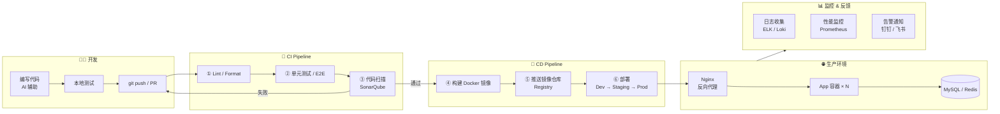

# 基于 AI 的全栈研发入门

主讲人：曾宏
时间：2026-04-03

## 一、打造最趁手的环境

### 1.1 常用开发工具推荐

| 工具类型    | 工具名称                                                              | Windows | macOS | Linux | 授权  | 说明                               |
| ------- | ----------------------------------------------------------------- | :-----: | :---: | :---: | :-: | -------------------------------- |
| IDE     | [IntelliJ IDEA](https://www.jetbrains.com/idea/)                  |    ✅    |   ✅   |   ✅   | 商业  | Java/Kotlin 开发首选                 |
| IDE     | [VS Code](https://code.visualstudio.com/)                         |    ✅    |   ✅   |   ✅   | 免费  | 其他语言首选，轻量、插件生态丰富，首选              |
| 版本控制    | [Git](https://git-scm.com/)                                       |    ✅    |   ✅   |   ✅   | 免费  | 必装，版本管理基础工具                      |
| Git GUI | [SourceTree](https://www.sourcetreeapp.com/)                      |    ✅    |   ✅   |   ❌   | 免费  | 可视化 Git 操作                       |
| 终端      | [SecureCRT]()                                                     |    ✅    |   ✅   |   ✅   | 商业  | 老牌终端                             |
| 包管理     | [Homebrew](https://brew.sh/)                                      |    ❌    |   ✅   |   ✅   | 免费  | macOS/Linux 包管理神器，Windows直接用 wsl |
| 容器      | [Docker Desktop](https://www.docker.com/products/docker-desktop/) |    ✅    |   ✅   |   ✅   | 免费  | 本地容器化开发环境（企业需付费）                 |
| API 调试  | [Postman](https://www.postman.com/)                               |    ✅    |   ✅   |   ✅   | 免费  | 接口调试与文档                          |
| API 调试  | [Apifox](https://apifox.com/)                                     |    ✅    |   ✅   |   ✅   | 免费  | 国产，集成 Mock/文档                    |
| 数据库     | [Navicat Premium](https://www.navicat.com/)                       |    ✅    |   ✅   |   ✅   | 商业  | 支持多种数据库，功能全面                     |
| 数据库     | [DataGrip](https://www.jetbrains.com/datagrip/)                   |    ✅    |   ✅   |   ✅   | 商业  | JetBrains 出品，智能 SQL 编辑           |
| 笔记/文档   | [Obsidian](https://obsidian.md/)                                  |    ✅    |   ✅   |   ✅   | 免费  | 本地 Markdown，知识管理                 |

> https://macwk.cn/
> https://www.0daydown.com/
> 你懂得!

### 1.2 AI时代的变化

#### 1.2.1 编码方式的转变

传统开发是"人写代码，工具辅助"；AI 时代变成"人描述意图，AI 生成代码，人审查验收"。核心能力从"记住语法"转向"清晰表达需求 + 判断代码质量"。

#### 1.2.2 AI 编程工具全景

| 类型        | 工具                                                                                                         | 说明                                                                             |
| --------- | ---------------------------------------------------------------------------------------------------------- | ------------------------------------------------------------------------------ |
| AI IDE    | [Cursor](https://www.cursor.com/) / [Kiro](https://kiro.dev/) / [Windsurf](https://codeium.com/windsurf) 等 | 基于 VS Code 的 AI 编程 IDE，深度集成 AI Agent                                           |
| CLI Agent | [Claude Code](https://docs.anthropic.com/en/docs/claude-code)                                              | Anthropic 出品，终端内直接操作代码库，适合复杂重构                                                 |
| CLI Agent | [OpenAI Codex CLI](https://github.com/openai/codex)                                                        | OpenAI 出品，有两个版本：CLI 版（命令行 Agent，操作本地代码库）和 App 版（[codex.com](https://codex.com) |

> 闲鱼
> 你懂得！

#### 1.2.3 MCP —— 让 AI 连接一切

**MCP（Model Context Protocol）** 是 Anthropic 提出的开放协议，让 AI 模型能够调用外部工具和数据源，就像给 AI 装上"手"。

- AI 不再只是聊天，可以直接操作数据库、调用 API、读写文件、执行命令
- 开发者可以自己编写 MCP Server，把任何系统接入 AI
- 主流 AI IDE（Cursor、Kiro、Windsurf）均已支持 MCP
- 常用 MCP Server：文件系统、数据库、浏览器控制、Git、Slack、Jira 等

```
用户说："帮我查一下数据库里最近注册的 10 个用户"
  → AI 调用 MCP Database Server
  → 执行 SQL 查询
  → 返回结果并解释
```

#### 1.2.4 Skills / Steering —— 让 AI 了解你的项目

AI 默认不了解你的项目规范、技术栈偏好、团队约定。通过 **Steering 文件**（`.kiro/steering/*.md`）可以把这些上下文持久化：

- 技术栈说明：用什么框架、数据库、代码风格
- 团队规范：命名约定、提交规范、分支策略
- 项目背景：业务领域、核心模块说明

这样每次和 AI 协作，它都能基于项目实际情况给出更准确的建议，而不是泛泛而谈。

#### 1.2.5 新的工作流

```
需求 → 和 AI 讨论方案 → AI 生成 Spec（需求/设计/任务拆解）
     → AI 逐任务实现 → 人工 Review → 测试验收 → 上线
```

关键变化：**你的主要工作从"写代码"变成"定义问题、审查结果、把控质量"**。

## 二、熟悉 DevOps 流程



## 三、开始全栈开发

### 3.1 需求

开发一个多终端实时同步的笔记工具

### 3.2 设计

TBD

### 3.3 开发

+ 中间件

魔法: docker-compose + PG + Redis

+ 后端

魔法: Go + Gin + GORM + wire

+ 前端

魔法: React + TypeScript + Tailwind CSS + shadcn/ui

## 四、部署应用

魔法: docker + nginx

## 五、测试应用

压力测试：wrk
自动化流程测试：playwrite
